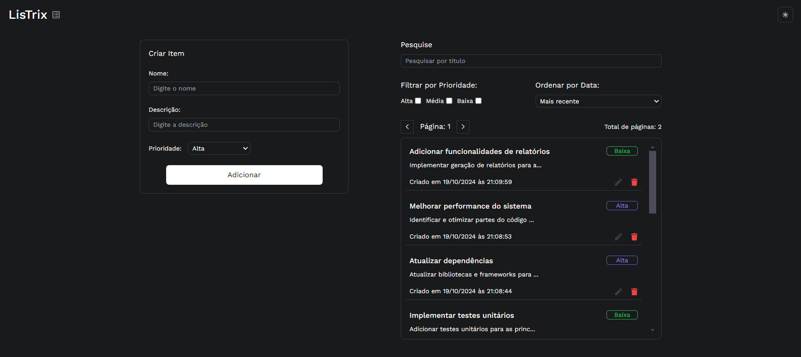
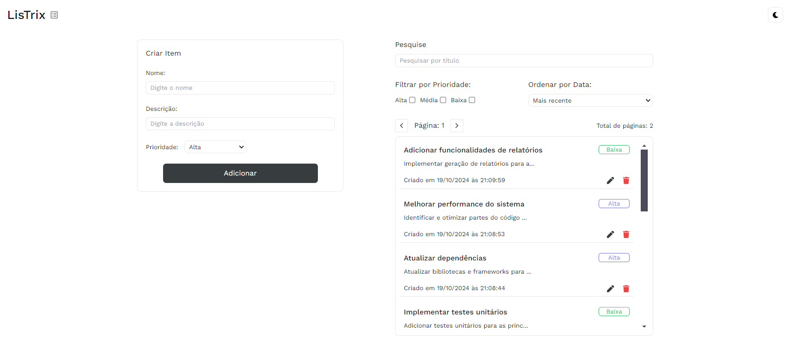
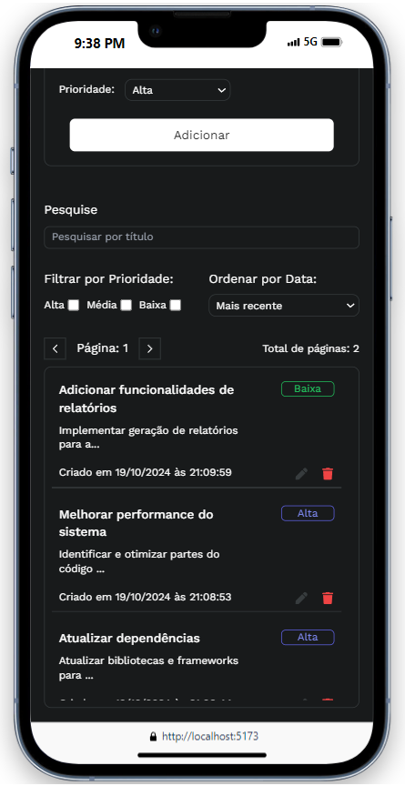
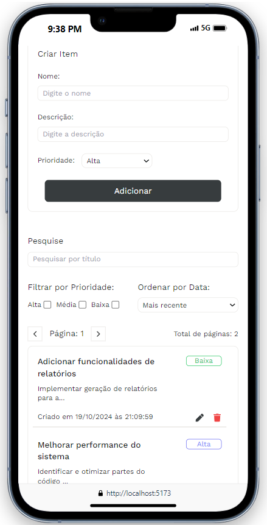

# Teste Técnico - Concentrix

- ### Desktop - Dark Mode

<p align="center">
    
</p>

- ### Desktop - Light Mode

<p align="center">
    
</p>

- ### Mobile - Dark Mode

<p align="center">
    
</p>

- ### Mobile - Light Mode

<p align="center">
    
</p>

## Instalação e Configuração 🔧

- Clone

```bash
    git clone https://github.com/Alfredo-Fontinele/Teste-Tecnico-Concentrix.git
```

- instale as dependências

```bash
    npm installl

    #ou
    yarn

    #ou
    pnpm i
```

- Iniciando

```bash
    npm run dev
```
